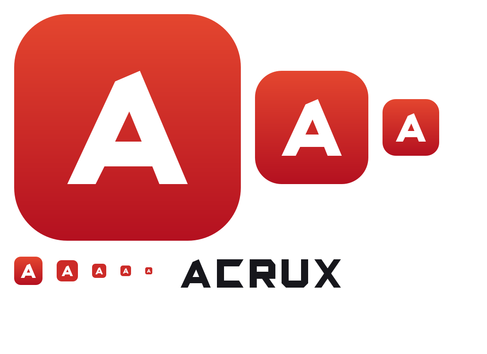

# Marque : Acrux



**Acrux** — l'étoile la plus brillante de la Croix du Sud, celle qui sert à
s'orienter dans l'hémisphère austral. Le mot contient « crux », le nœud du
problème, le point essentiel. Deux syllabes, cinq lettres, la même
prononciation en français et en anglais.

Le nom commence par **Acr** : qui cherche son lecteur de PDF en tapant les
trois premières lettres tombe dessus.

## Le signe

Un « A » bâti sur une grille de 128, graisse 16, hauteur de capitale 64. Son
sommet n'est pas une pointe : c'est une **facette coupée en biais**. Cette
coupe est la signature de la marque, et elle revient sur les extrémités libres
du mot-symbole (le C, le R, le U).

La lettre occupe 30 à 98 en largeur et 32 à 96 en hauteur, centrée dans la
tuile.

## Couleurs

| Rôle | Valeur |
|---|---|
| Tuile, haut | `#E44630` |
| Tuile, bas | `#B41020` |
| Tuile, aplat (sous 64 px) | `#CC2B28` |
| Lettre | `#FFFFFF` |
| Encre du mot-symbole | `#17171B` |

Sous 64 pixels, le dégradé ne se voit plus et salit l'anticrénelage : l'aplat
le remplace. C'est ce que fait le générateur.

## Fichiers

| Fichier | Usage |
|---|---|
| `acrux-icon.svg` | le symbole, taille libre |
| `acrux-mot.svg` | le mot seul |
| `acrux-logo.svg` | symbole et mot côte à côte |
| `acrux-icon-<taille>.png` | 16 à 512, pour les interfaces et les dépôts |
| `acrux-icon-mono-512.png` | une seule encre, sans tuile |
| `acrux-mot.png`, `acrux-mot-blanc.png` | mot-symbole sur fond clair ou sombre |
| `acrux.ico` | icône de l'exécutable Windows (7 tailles), incorporée à la compilation |
| `acrux-planche.png` | planche de contrôle, toutes les tailles |

## Régénérer

Les PNG et la planche sont **dessinés par notre propre rasteriseur**, pas par
un outil extérieur :

```bash
cargo test -p acrux-graphics --test brand -- --ignored generate
python tools/make_ico.py branding
```

La géométrie vit dans `crates/acrux-graphics/tests/brand.rs`, avec des tests qui
vérifient que la lettre reste dans la tuile, que la tuile couvre la grille, que
les pixels attendus sont blancs ou rouges, et que le croisement du X n'est pas
percé (chaque lettre porte sa règle de remplissage : pair-impair pour le A qui
a des contre-formes, non-nul pour celles faites de morceaux qui se recouvrent).
Les SVG reprennent exactement les mêmes coordonnées.

## Dans l'exécutable

`acrux.ico` n'est pas un fichier à côté du programme : il est **incorporé dans
`acrux.exe` et `acr.exe`** au moment de l'édition de liens, par le module
`crates/acrux-winres/`, qui écrit lui-même la ressource Windows (sans `rc.exe`
ni bibliothèque externe). La fenêtre la recharge ensuite avec `LoadImageW`,
à la taille que demande le système, pour la barre de titre et la barre des
tâches.

Contrôle rapide de ce qu'un exécutable porte vraiment :

```powershell
(Get-Item target
eleasecrux.exe).VersionInfo | Format-List *
```

## Usage

- Garder une marge libre d'au moins un huitième du côté autour de la tuile.
- Ne pas changer les proportions, ne pas incliner, ne pas ajouter d'ombre
  portée, ne pas recolorer la lettre.
- Sur fond sombre, utiliser `acrux-mot-blanc.png` pour le mot ; la tuile, elle,
  fonctionne sur les deux.

## Indépendance

Cette marque est dessinée pour ce projet. Elle n'emprunte aucun élément à un
logiciel existant : ni nom, ni lettre, ni couleur exacte, ni géométrie. La
ressemblance de famille avec les icônes d'applications modernes — une tuile aux
coins arrondis, une lettre blanche — est celle d'une convention partagée, pas
d'un emprunt.
